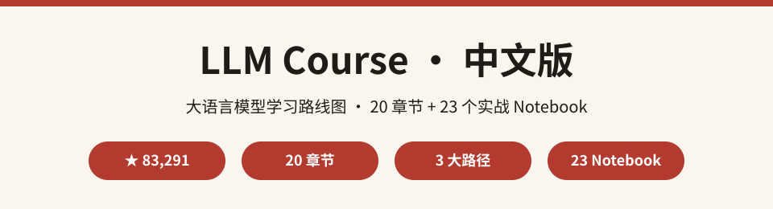
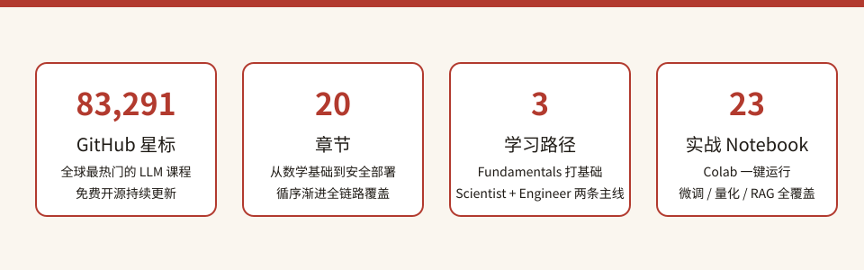
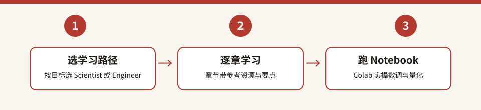

  

# LLM Course 中文版

> **全球最热门的免费大语言模型课程 · 中文导航版**
> 源自 GitHub 上 **83,000+ ★** 的 [mlabonne/llm-course](https://github.com/mlabonne/llm-course)，收录 **20 个章节 + 23 个 Colab 实战 Notebook**，覆盖从数学基础、模型预训练、微调对齐到 RAG、Agent 与安全部署的全链路，是零基础入门 LLM 的最优路线图。

---

## 目录

- [这是什么？](#这是什么)
- [为什么值得收藏](#为什么值得收藏)
- [数据一览](#数据一览)
- [快速开始](#快速开始)
- [分类清单](#分类清单)
- [全量章节索引](#全量章节索引)
- [完整数据](#完整数据)
- [常见问题 FAQ](#常见问题-faq)
- [参与贡献](#参与贡献)
- [致谢](#致谢)
- [许可声明](#许可声明)

---

## 这是什么？

**LLM Course 中文版** 是对 GitHub 最热门的免费 LLM 课程 [mlabonne/llm-course](https://github.com/mlabonne/llm-course) 的中文二次开发项目。

源项目由 Maxime Labonne 创建并持续维护，把「从零进入大语言模型世界」整理成一份结构化的学习路线图，分为三大路径：
- 🧩 **LLM Fundamentals（4 章，可选）**：机器学习数学、Python、神经网络、NLP 基础，按需查阅；
- 🧑‍🔬 **The LLM Scientist（8 章）**：如何用最新技术构建最好的 LLM——从架构、预训练到微调、对齐、评估、量化；
- 👷 **The LLM Engineer（8 章）**：如何构建并部署 LLM 应用——运行模型、向量存储、RAG、Agent、推理优化、部署与安全。

每个章节都附「📚 References」精选外部资料（视频 / 文章 / 框架），并配套 **23 个 Colab Notebook**（微调 Llama、ORPO、DPO、量化 GGUF/GPTQ、MergeKit 模型合并……）一键运行。

**中文版做了什么：**
- 🗂️ 把源课程 **20 个章节** 全量提取为中文索引（[course-index.md](course-index.md)），三大路径分组、逐章中文译名 + 一句话要点；
- ⚡ 在本 README 给出路径总览表与精选章节导读；
- 📖 提炼「三步上手」学习路径与 FAQ，让你从零开始规划自己的 LLM 学习路线。

## 为什么值得收藏

- 🗺️ **结构化路线图**：三路径 20 章，从数学基础到生产部署，跟着走就能学完；
- 🧪 **23 个实战 Notebook**：Colab 一键运行，微调 Llama 3.1、ORPO、DPO、量化、模型合并全实操；
- 📚 **章节自带参考**：每章 3-10 个精选外部资料，视频 + 文章 + 框架配套学习；
- 🆓 **完全免费**：课程永久免费，作者另著有《LLM Engineer's Handbook》付费书可支持；
- 🔥 **社区验证**：83,000+ 星、数万人据此转型 AI 工程师，配套 DeepWiki 增强版导航；
- 🇨🇳 **中文友好**：全量章节译名 + 要点导读 + 上手指引，英文课程也不再劝退。

## 数据一览

  

> 数字全部来自源仓 [README.md](https://github.com/mlabonne/llm-course/blob/main/README.md) 全文实际统计（星数 GitHub 实测；章节数按编号章节标题计数；Notebook 数按 Notebooks 部分逐条计数，2026-10-05 核实）。

## 快速开始

### 三步上手

  

1. **选路径**：想当「模型科学家」走 Scientist 线（微调 / 对齐 / 量化）；想当「AI 工程师」走 Engineer 线（RAG / Agent / 部署）；基础薄弱先补 Fundamentals；
2. **逐章学习**：按 [course-index.md](course-index.md) 逐章推进，先看章节要点，再啃「📚 References」里的视频与文章；
3. **跑 Notebook**：打开配套 Colab Notebook 实操——从「用 Unsloth 微调 Llama 3.1」开始，把理论变成动手能力。

### 示例：从 1 章微调到能跑的模型

以 Scientist 线为例：学完「LLM 架构」后，直接打开 Fine-tuning 组的「Fine-tune Llama 3.1 with Unsloth」Notebook，在 Colab 免费 GPU 上完成一次 QLoRA 微调，再配合「4-bit Quantization using GPTQ」Notebook 把模型量化到消费级显卡可跑。

## 分类清单

三大路径 × 20 章节总览：

| 路径 | 章节 | 中文译名 | 一句话要点 |
| --- | --- | --- | --- |
| 🧩 Fundamentals | 1 | 机器学习数学基础 | 线性代数 / 微积分 / 概率统计 |
| 🧩 Fundamentals | 2 | Python 机器学习 | 数据科学库与数据预处理 |
| 🧩 Fundamentals | 3 | 神经网络 | 反向传播 / 优化器 / 防过拟合 |
| 🧩 Fundamentals | 4 | 自然语言处理 | 分词 / 词嵌入 / RNN |
| 🧑‍🔬 Scientist | 1 | LLM 架构 | Transformer / 分词 / 注意力 / 采样 |
| 🧑‍🔬 Scientist | 2 | 预训练模型 | 数据准备 / 分布式训练 / 监控 |
| 🧑‍🔬 Scientist | 3 | 后训练数据集 | 指令数据 / 合成数据 / 质量过滤 |
| 🧑‍🔬 Scientist | 4 | 监督微调 | LoRA / QLoRA / 训练参数调优 |
| 🧑‍🔬 Scientist | 5 | 偏好对齐 | DPO / GRPO / PPO / RLHF |
| 🧑‍🔬 Scientist | 6 | 模型评估 | 基准测试 / 对齐评估 / 好hart定律 |
| 🧑‍🔬 Scientist | 7 | 量化 | GGUF / GPTQ / EXL2 压缩到消费级 |
| 🧑‍🔬 Scientist | 8 | 前沿趋势 | 模型合并 / 新兴训练技术 |
| 👷 Engineer | 1 | 运行 LLM | 模型访问与基础提示 |
| 👷 Engineer | 2 | 向量存储 | 文档摄入与嵌入 |
| 👷 Engineer | 3 | 检索增强生成 RAG | 基础检索增强 |
| 👷 Engineer | 4 | 高级 RAG | 查询优化与工具 |
| 👷 Engineer | 5 | Agent 智能体 | 自主任务执行与协议 |
| 👷 Engineer | 6 | 推理优化 | 性能调优 |
| 👷 Engineer | 7 | 部署 LLM | 生产环境部署 |
| 👷 Engineer | 8 | 安全加固 LLM | 提示注入 / 后门 / 防御 |

## 全量章节索引

📄 **[course-index.md](course-index.md)** — 收录源课程全部 **20 个章节**：章节译名 + 一句话要点 + 源 README 锚点直达链接，按三大路径分组。

## 完整数据

- 📦 源仓库：[mlabonne/llm-course](https://github.com/mlabonne/llm-course)（默认分支 `main`，Apache License 2.0）
- 👤 作者：Maxime Labonne（[X/Twitter](https://twitter.com/maximelabonne) / [Hugging Face](https://huggingface.co/mlabonne) / [博客](https://mlabonne.github.io/blog)）
- 📙 配套书籍：《LLM Engineer's Handbook》（Packt Publishing，基于本课程）
- 🌐 DeepWiki 增强版：https://deepwiki.com/mlabonne/llm-course/
- 📄 源 README（英文原文）：[README.md](https://github.com/mlabonne/llm-course/blob/main/README.md)

## 常见问题 FAQ

**Q1：零基础能学吗？**
能。Fundamentals 路径专为基础薄弱者设计（数学 / Python / 神经网络），按需查阅；直接想动手的可以从 Engineer 路径 1 章开始。

**Q2：跑 Notebook 需要花钱吗？**
Colab 免费额度即可跑大部分 Notebook（微调用 Unsloth 极省显存）；长时间训练建议购买 Colab 付费计划。

**Q3：Scientist 和 Engineer 必须都学吗？**
不必。想训练模型走 Scientist，想构建应用走 Engineer；两条主线可并行，Fundamentals 按需补充。

**Q4：课程会过时吗？**
LLM 领域演进快，但作者持续更新章节（如前沿趋势章覆盖模型合并与新训练技术），DeepWiki 也有增强版镜像。

**Q5：这个中文版和源项目是什么关系？**
本项目是中文**课程导航与导读**，章节正文、Notebook、参考资料都在源项目。所有内容链接均跳转源仓，版权归源项目及作者。

## 参与贡献

- 🐛 发现译名或链接错误：提 Issue；
- 🌐 补充 / 修正章节中文译名：Fork 后修改 [course-index.md](course-index.md) 提 PR；
- 📝 分享你的 LLM 学习笔记与踩坑经验：欢迎在 Issue 交流。

## 致谢

- 感谢 [Maxime Labonne](https://github.com/mlabonne) 创作并免费开源这套了不起的 LLM 课程；
- 感谢配套书籍《LLM Engineer's Handbook》与 DeepWiki 增强版；
- 感谢每一位正在迈向 LLM 世界的你 🌟

## 许可声明

- 本仓库代码与文档：**MIT License**（见 [LICENSE](LICENSE)，Copyright (c) 2026 zieang88888）；
- 源项目 [mlabonne/llm-course](https://github.com/mlabonne/llm-course)：**Apache License 2.0**；
- 第三方声明与完整署名见 [THIRD_PARTY_NOTICES.md](THIRD_PARTY_NOTICES.md)。
